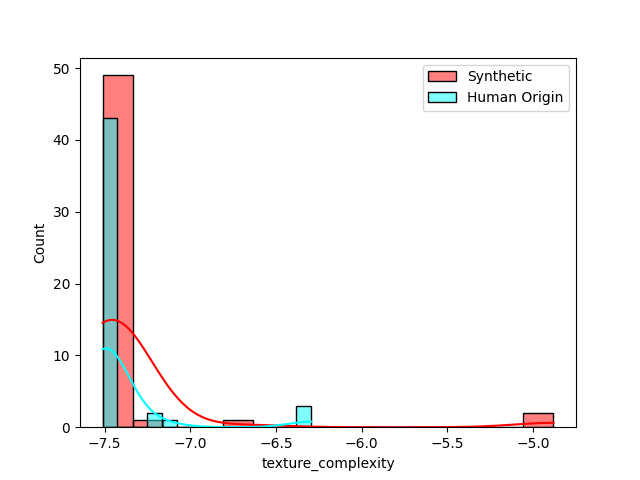

<br>
<br>

# negate <br>

entrypoint synthetic image classifier

[](https://github.com/darkshapes/negate/actions/workflows/negate.yml)

## About

A command-line tool and Python library for processing and analyzing images, extracting Laplacian residuals to measure fractal and texture complexity, and other comparative analysis methods to discriminate synthetic images from real ones.

## Test Results

Demonstration of the provided test results and visualizations on our synthetic [darkshapes/a_slice dataset](https://huggingface.co/darkshapes/a_slice) and private works of human origin provided by consent from the generous artists at https://purelyhuman.xyz.




<!-- 
 -->

## Install

> [!IMPORTANT]
>
> Requires [uv](https://github.com/astral-sh/uv)

```bash
git clone https://github.com/darkshapes/negate.git
cd negate
uv sync
```

<sub>macos/linux</sub>

```bash
source .venv/bin/activate
```

<sub>windows</sub>

```powershell
Set-ExecutionPolicy Bypass -Scope Process -Force; .venv\Scripts\Activate.ps1
```

## Test:

Add human-origin assets to assets/real

```sh
python -m tests.test_extract -v
```

## Scan A Folder or File

```bash
usage: negate [-h] [-i INPUT] [-g] [-v] [-o OUTPUT]

Extract Laplacian residuals from images.

options:
  -h, --help           show this help message and exit
  -i, --input INPUT    Input folder or individual image.
  -g, --graph          Graph the distribution of residuals on a plot
  -v, --verbose        Enable verbose output.
  -o, --output OUTPUT  (OPTIONAL) Output folder for residuals.
```

## Train Model:

```sh
python -m negate.train
```

## Call from another application

```py
import asyncio
from pathlib import Path

from negate import ResidualExtractor, flag_origin

image_path = "some/image/path.jpg"
output_folder = ".output"

residual_extractor = ResidualExtractor(image_path, output_folder, verbose=False)

async def async_main() -> tuple[list,list]:
    fractal, texture = await residual_extractor.process_residuals()
    return residual_extractor

residual_extractor = asyncio.run(async_main())
flag_origin(residual_extractor)

```
