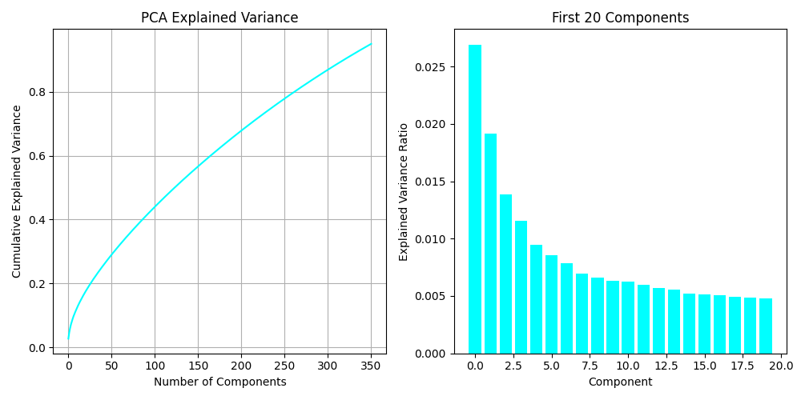
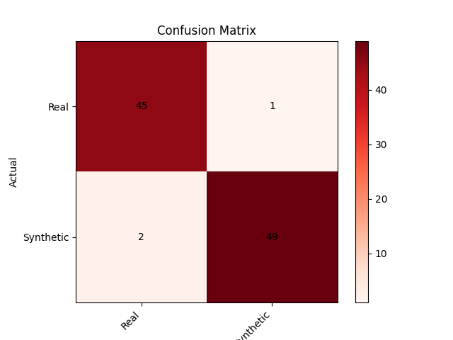

<br>
<br>

# negate <br>

entrypoint synthetic image classifier

[](https://github.com/darkshapes/negate/actions/workflows/negate.yml)

## About

A command-line tool and Python library for processing and analyzing images, providing methods for feature extraction, laplacian and spectral residual processing, and other comparative analysis methods to discriminate between synthetic images and real ones.

## Overview

We use a modern VAE to extract features from images generated using Diffusers, ComfyUI, Darkshapes tools (Zodiac/Divisor/singularity) and Google Nano-Banana. Using a modular pipeline that integrates a combination of feature extraction techniques such as spectral residual analysis and feature vectors extracted from the images, we train a Gradient Boosting Decision Tree model and its associated PCA transformer to distinguish between images of synthetic and human origin. Preliminary results demonstrate high accuracy in detecting synthetic images.

This repo provides a simple command‑line interface to invoke the tool and examples of integrating the library of predictions and metrics into other works. We make all attempts to follow continuous integration best practices for deploying and maintaining software, ensuring the code is readied for production environments.

Future work includes the development of an automated testing framework and evaluation suite, expanding the scope of research to include wider diversity of synthetic and original human-generated datasets, benchmarking against comparable methods, and exploring additional model architectures.





## Requirements

- A dataset of images made by human artists with width and height dimensions larger than 512 pixels. This will serve as ground truth and should be placed in the `/assets` folder.
- A [huggingface](https://hf.co) account that will be used to download models and synthetic datasets. Create an API Key at their website, then sign in with `hf auth login`.
- It is recommended to run `negate` on a GPU to ensure efficient processing and reduced training time.

> [!NOTE]
>
> Our training results and visualizations were created with data provided consensually by generous artists at https://purelyhuman.xyz. We don't have permission to share that dataset here.

## Install

> [!IMPORTANT]
>
> Requires [uv](https://github.com/astral-sh/uv)

```bash
git clone https://github.com/darkshapes/negate.git
cd negate
uv sync
```

<sub>macos/linux</sub>

```bash
source .venv/bin/activate
```

<sub>windows</sub>

```powershell
Set-ExecutionPolicy Bypass -Scope Process -Force; .venv\Scripts\Activate.ps1
```

## CLI:

Basic Syntax:

```sh
usage: negate [-h] {train,check} ...

Negate CLI

positional arguments:
  {train,check}
    train        Train model on the dataset in the provided path or `assets/`. The resulting model will be saved to disk.
    check        Check whether an image at the provided path is synthetic or original.

options:
  -h, --help     show this help message and exit
```

Training syntax:

```sh
usage: negate train [-h] [--model {black-forest-labs/FLUX.2-dev,black-forest-labs/FLUX.2-klein-9B,Tongyi-MAI/Z-Image,Freepik/F-Lite-Texture}] [path]

positional arguments:
  path                  Dataset path

options:
  --model {black-forest-labs/FLUX.2-dev,black-forest-labs/FLUX.2-klein-9B,Tongyi-MAI/Z-Image,Freepik/F-Lite-Texture}
                        Change the VAE model to use for training to a supported HuggingFace repo. Accuracy and memory use decrease from left to right
```

Check the origin of an image:
``
usage: negate check [-h] path

positional arguments:
path Image path

options:
-h, --help show this help message and exit

```

```
