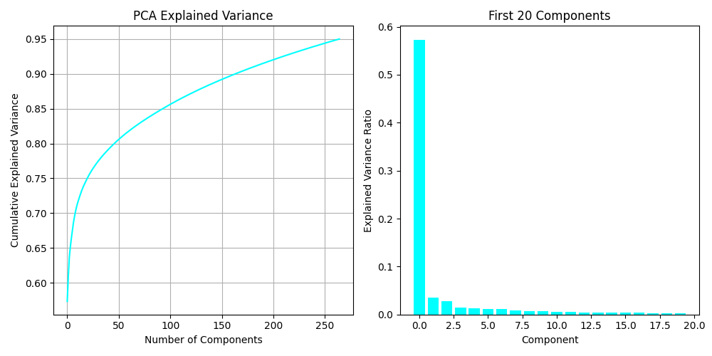
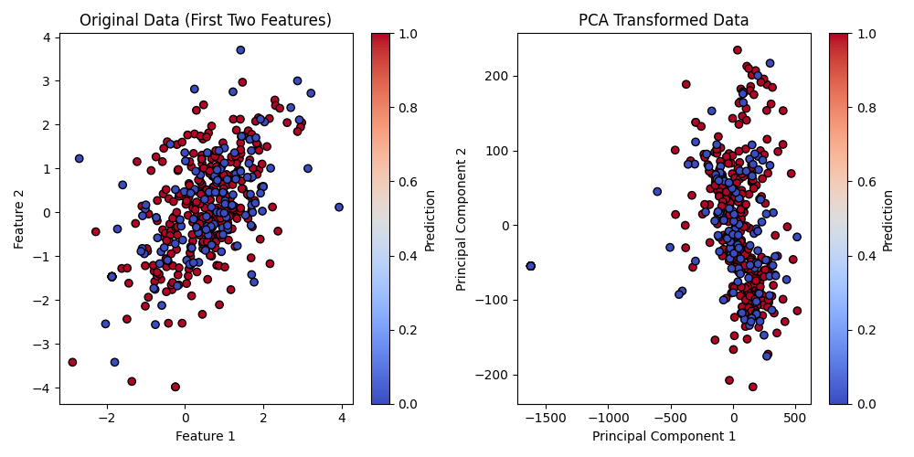
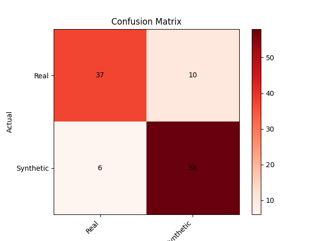

<br>
<br>

# negate <br>

entrypoint synthetic image classifier

[](https://github.com/darkshapes/negate/actions/workflows/negate.yml)

## About

A command-line tool and Python library for processing and analyzing images, extracting Laplacian residuals to measure fractal and texture complexity, and other comparative analysis methods to discriminate synthetic images from real ones.

> [!NOTE]
>
> Demonstration of the provided test results and visualizations on our synthetic [darkshapes/a_slice dataset](https://huggingface.co/darkshapes/a_slice) and private works of human origin provided by consent from the generous artists at https://purelyhuman.xyz.

## Results Overview





## Install

> [!IMPORTANT]
>
> Requires [uv](https://github.com/astral-sh/uv)

```bash
git clone https://github.com/darkshapes/negate.git
cd negate
uv sync
```

<sub>macos/linux</sub>

```bash
source .venv/bin/activate
```

<sub>windows</sub>

```powershell
Set-ExecutionPolicy Bypass -Scope Process -Force; .venv\Scripts\Activate.ps1
```

## CLI:

Add human-origin assets to `assets/` folder

```sh
usage: negate [-h] {train,check} ...

Negate CLI

positional arguments:
  {train,check}
    train        Train model on the dataset in the provided path or `assets/`. The resulting model will be saved to disk.
    check        Check whether an image at the provided path is synthetic or original.

options:
  -h, --help     show this help message and exit
```
