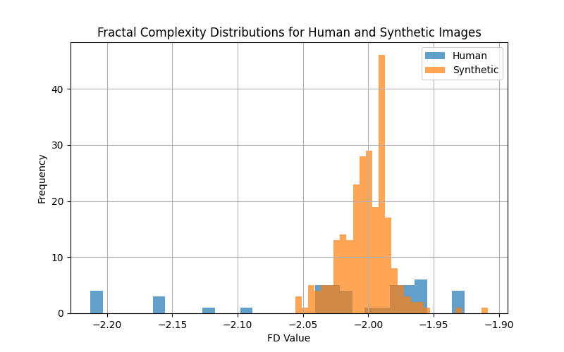
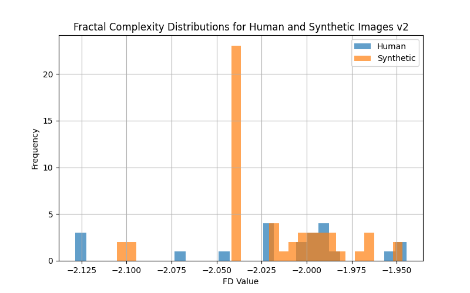
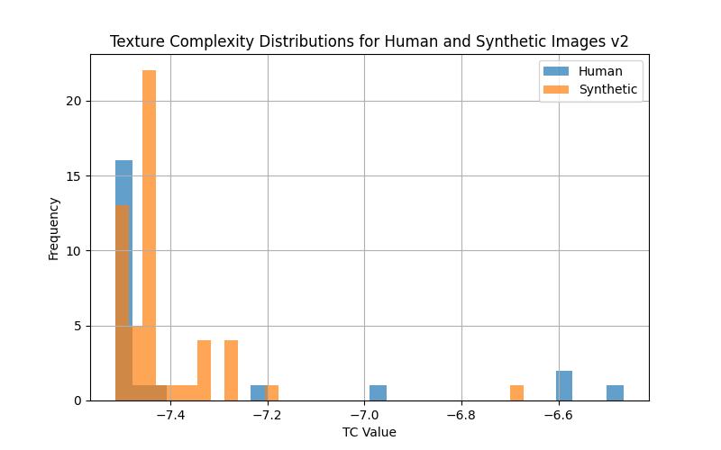

<br>
<br>

# negate <br>

entrypoint synthetic image classifier

## About

A command-line tool and Python library for processing and analyzing images, extracting Laplacian residuals to measure fractal and texture complexity, and other comparative analysis methods to discriminate synthetic images from real ones.

## Test Results

Demonstration of the provided test results and visualizations on our synthetic [darkshapes/a_slice dataset](https://huggingface.co/darkshapes/a_slice) and private works of human origin provided by consent from the generous artists at https://purelyhuman.xyz.






## Install

> [!IMPORTANT]
>
> Requires [uv](https://github.com/astral-sh/uv)

```bash
git clone https://github.com/darkshapes/negate.git
cd negate
uv sync
```

<sub>macos/linux</sub>

```bash
source .venv/bin/activate
```

<sub>windows</sub>

```powershell
Set-ExecutionPolicy Bypass -Scope Process -Force; .venv\Scripts\Activate.ps1
```

## Test:

```sh
python -m tests.test_extract -v
```

## Scan A Folder or File

```bash
usage: negate [-h] [-i INPUT] [-o OUTPUT] [-v]
```

```
Extract Laplacian residuals from images.

options:
  -h, --help           show this help message and exit
  -i, --input INPUT    Input folder containing images or individual image.
  -o, --output OUTPUT  Output folder for residuals.
  -v, --verbose        Enable verbose output.

```

## Call from another application

```py
import asyncio

from negate import ResidualExtractor

residual_extractor = ResidualExtractor(image_path, output_folder, verbose=verbose)

async def async_main() -> tuple:
    fractal, texture = await residual_extractor.process_residuals()
    return (fractal, texture)

asyncio.run(async_main())
```

Special thanks to <https://github.com/Sandeep-git1/Deepfake_image_detection> for initial prototype.
