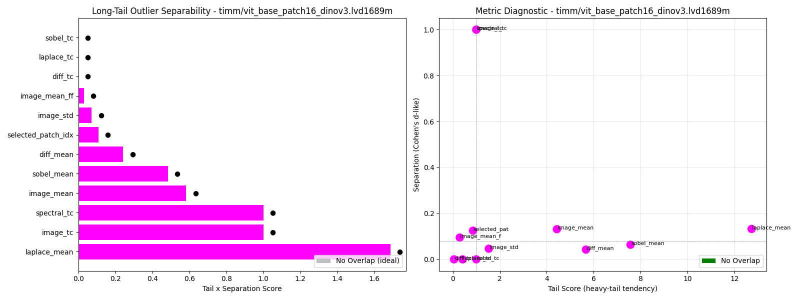
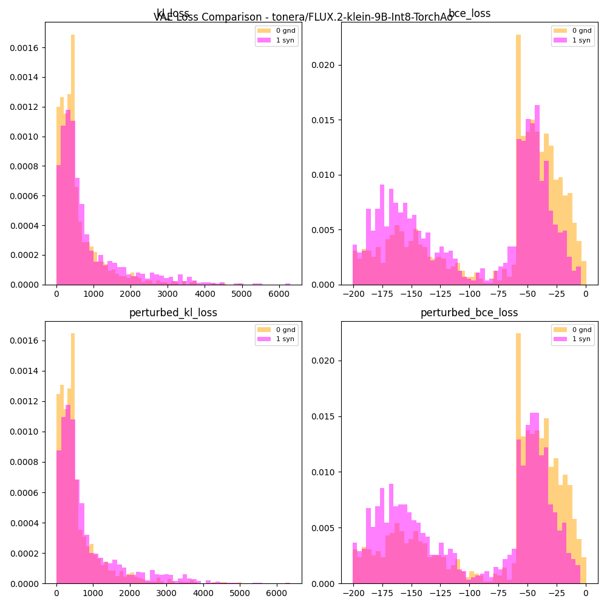

---
language:
  - en
library_name: nnll
license_name: MPL-2.0 + Commons Clause 1.0
---

<div align="center">

</div>

# negate <br><sub> entrypoint synthetic image classifier</sub>

A CLI tool and Python library for ongoing research of origin prediction tasks using image processing and feature extraction.

[](https://github.com/darkshapes/negate/actions/workflows/negate.yml)<br>
[](https://discord.gg/VVn9Ku74Dk)<br>
[](https://ko-fi.com/darkshapes)<br>
<br>

## Overview

<div align="center">



</div>

Negate is a modular system of image processing and feature extraction pipelines aimed towards critical analysis of effective techniques that can differentiate synthetic and human-origin works. Techniques include spectral residual analysis, laplacian residual analysis, random resize crop, local binary pattern, haar wavelet perturbation, and measuring l1 and mse loss. We also study the efficacy of a gradient-boosted decision tree and PCA trained to distinguish between images of synthetic and human origin.

This repo provides a simple command‑line interface to invoke classification and examples of integrating our library of training scripts, predictions and metrics into other works. We make all attempts to follow continuous integration best practices for deploying and maintaining software, ensuring the code is readied for production environments.

Future work includes the development of an automated testing framework and evaluation suite, expanding the scope of research to include wider diversity of synthetic and original human-generated datasets, benchmarking against comparable methods, and exploring additional model architectures.

Results were obtained using a curated dataset of approximately 2000 images of known origin. Synthetic images have been generated by Diffusers, ComfyUI, Darkshapes tools (Zodiac/Divisor/singularity), Google Nano-Banana, Midjourney, and Seedream, while art authored by humans was supplied by consent from artist volunteers.

> [!NOTE]
>
> Our training results and visualizations were created with data provided consensually by generous artists at https://purelyhuman.xyz. We don't have and won't seek permission to share their art here.

## Requirements

- A dataset of images made by human artists with a minimum width and height of 512 pixels but preferably 1024px or greater. This will serve as ground truth and should be placed in the `/assets` folder.
- A [huggingface](https://hf.co) account that will be used to download models and synthetic datasets. Create an API Key at their website, then sign in with `hf auth login`. Some datasets may use .ZIP files which should be extracted to local folders.
- It is recommended to run `negate` on a machine with a GPU to ensure efficient processing and reduced training time.

## Install

[](https://github.com/astral-sh/uv)
[](https://github.com/astral-sh/ruff)
[](https://github.com/pytest-dev/pytest)<br>

```bash
git clone https://github.com/darkshapes/negate.git
cd negate
uv sync
```

<sub>macos/linux</sub>

```bash
source .venv/bin/activate
```

<sub>windows</sub>

```powershell
Set-ExecutionPolicy Bypass -Scope Process -Force; .venv\Scripts\Activate.ps1
```

## Default Folder Locations and Configuration Options

- [.datasets](.datasets) : For downloaded datasets. (HuggingFace Hub)
- [/assets](/assets) : For local datasets.
- [/models](/models) : For downloaded models (HuggingFace Hub)
- [/models](/models)/`YYMMDD_HHMMSS` Models trained and exported by `negate` are placed in dated subfolders of `/models`.
- [/results](/results): For training and inference result graphs.
- [config/config.toml](config/config.toml) specifies all the data, model, training and inference parameters above. Main commands and additional paths or models may be chosen at runtime using the CLI.

## Using the CLI:

Basic Syntax:

### Command List

```bash
usage: negate [-h] {pretrain,train,infer} ...

Negate CLI

positional arguments:
  {pretrain,train,infer}
    pretrain            Analyze and graph performance of image preprocessing on the image dataset at the provided path from CLI and config paths, default
                        `assets/`.
    train               Train XGBoost model on preprocessed image features using the image dataset in the provided path or `assets/`. The resulting model will
                        be saved to disk.
    infer               Infer whether an image at the provided path is synthetic or original.

options:
  -h, --help            show this help message and exit
```

Run pre-training pipe (ensemble image preprocessing and analysis):

```bash
uusage: negate pretrain [-h]
                       [-m {['timm/vit_base_patch16_dinov3.lvd1689m'],['nvidia/C-RADIOv4-SO400M', 'facebook/dinov3-vitl16-pretrain-sat493m'],['hf-hub:timm/MobileCLIP2-S4-OpenCLIP']}]
                       [-a {tonera/FLUX.2-klein-9B-Int8-TorchAo,exdysa/dc-ae-f32c32-sana-1.1-diffusers,Freepik/F-Lite-Texture,exdysa/dc-ae-f32c32-sana-1.1-diffusers,black-forest-labs/FLUX.2-dev,Tongyi-MAI/Z-Image,exdysa/mitsua-vae-SAFETENSORS,,}]
                       [path]

positional arguments:
  path                  Genunie/Human-original image dataset path

options:
  -h, --help            show this help message and exit
  -m, --model {['timm/vit_base_patch16_dinov3.lvd1689m'],['nvidia/C-RADIOv4-SO400M', 'facebook/dinov3-vitl16-pretrain-sat493m'],['hf-hub:timm/MobileCLIP2-S4-OpenCLIP']}
                        Model to use. Default :timm/vit_base_patch16_dinov3.lvd1689m
  -a, --ae {tonera/FLUX.2-klein-9B-Int8-TorchAo,exdysa/dc-ae-f32c32-sana-1.1-diffusers,Freepik/F-Lite-Texture,exdysa/dc-ae-f32c32-sana-1.1-diffusers,black-forest-labs/FLUX.2-dev,Tongyi-MAI/Z-Image,exdysa/mitsua-vae-SAFETENSORS,,}
                        Model to use. Default :timm/vit_base_patch16_dinov3.lvd1689m
```

Training a model to distinguish genuine from synthetic art:

```bash
  from pkg_resources import resource_stream
usage: negate train [-h]
                    [-m {['timm/vit_base_patch16_dinov3.lvd1689m'],['nvidia/C-RADIOv4-SO400M', 'facebook/dinov3-vitl16-pretrain-sat493m'],['hf-hub:timm/MobileCLIP2-S4-OpenCLIP']}]
                    [-a {tonera/FLUX.2-klein-9B-Int8-TorchAo,exdysa/dc-ae-f32c32-sana-1.1-diffusers,Freepik/F-Lite-Texture,exdysa/dc-ae-f32c32-sana-1.1-diffusers,black-forest-labs/FLUX.2-dev,Tongyi-MAI/Z-Image,exdysa/mitsua-vae-SAFETENSORS,,}]
                    [path]

positional arguments:
  path                  Genunie/Human-original image dataset path

options:
  -h, --help            show this help message and exit
  -m, --model {['timm/vit_base_patch16_dinov3.lvd1689m'],['nvidia/C-RADIOv4-SO400M', 'facebook/dinov3-vitl16-pretrain-sat493m'],['hf-hub:timm/MobileCLIP2-S4-OpenCLIP']}
                        Model to use. Default :timm/vit_base_patch16_dinov3.lvd1689m
  -a, --ae {tonera/FLUX.2-klein-9B-Int8-TorchAo,exdysa/dc-ae-f32c32-sana-1.1-diffusers,Freepik/F-Lite-Texture,exdysa/dc-ae-f32c32-sana-1.1-diffusers,black-forest-labs/FLUX.2-dev,Tongyi-MAI/Z-Image,exdysa/mitsua-vae-SAFETENSORS,,}
                        Model to use. Default :timm/vit_base_patch16_dinov3.lvd1689m
```

Infer the origin of an image or folder of images:

```
usage: negate infer [-h] [-m {20260221_182340,20260219_221715}] path

positional arguments:
  path                  Path to the image or directory containing images of unknown origin

options:
  -h, --help            show this help message and exit
  -m, --model {20260221_182340,20260219_221715}
```

## Graph Results

<div align="center">

</div>

## Related Research:

- [arxiv:2511.14030](https://arxiv.org/abs/2511.14030)
- [arxiv:2505.11278](https://arxiv.org/abs/2505.11278)
- [arxiv:2502.15176](https://arxiv.org/abs/2502.15176)
- [arxiv:2411.19417](https://arxiv.org/abs/2411.19417)
- [arxiv:2409.07913](https://arxiv.org/abs/2409.07913)
- [VeridisQuo](https://github.com/VeridisQuo-orga/VeridisQuo)
- https://drive.google.com/file/d/1bxDmREBn-TkTe-GkcLVD9_bVw3nokehI/view

```bib
@misc{darkshapes2026,
    author={darkshapes},
    title={negate},
    year={2026},
    primaryClass={cs.CV},
    howpublished={\url={https://github.com/darkshapes/negate}},
}
```
