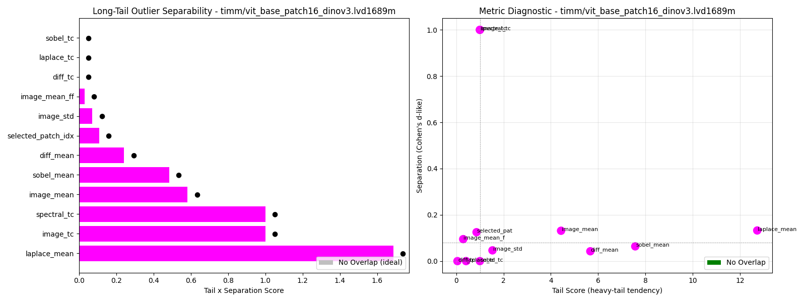
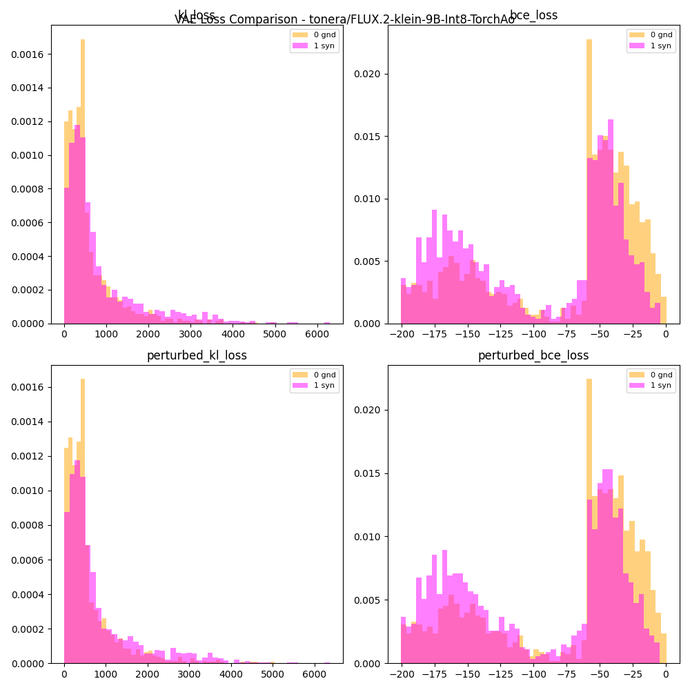

---
language:
  - en
library_name: nnll
license_name: MPL-2.0 + Commons Clause 1.0
compatibility:
  - macos
  - windows
  - linux
---

<div align="center">

</div>

# negate <br><sub> entrypoint synthetic image classifier</sub>

A scanning, training, and research library for detecting the origin of digital images.

[](https://ko-fi.com/darkshapes)<br>
<br>

## Quick Start

<sup> Terminal</sup>
<sup> Powershell</sup>
<sup> sh</sup>

> **1.** [](https://docs.astral.sh/uv/#installation)

> **2.** `uv tool install 'negate @ git+https://github.com/darkshapes/negate'`

> **3.** `negate infer image.webp`

</sup>

| Result | Translated Source    |
| ------ | -------------------- |
| `SYN`  | **Synthetic/AI**     |
| `GNE`  | **Genuine/Human**    |
| `?`    | **High Uncertainty** |

> [!TIP]
> To run without installing, use the `uv` command `uvx --from 'negate @ git+https://github.com/darkshapes/negate' infer image.webp`

## Training

Train a new model with the following command:

`negate train`

> [!TIP]
> type a `path` to an image file or directory of image files to add genuine human origin assets to the dataset
> add synthetic images using _`-s`_ before a `path`

## Technical Details & Research Results

<details><summary> Expand</summary>

### Structure

Directories are located within `$HOME\.local\bin\uv\tools` or `.local/bin/uv/tools`

| Data                  | Location                                      | source                                |
| --------------------- | --------------------------------------------- | ------------------------------------- |
| adjustable parameters | [config/config.toml](config/config.toml)      | included                              |
| downloaded datasets   | `.datasets/`                                  | [HuggingFace](https://huggingface.co) |
| downloaded models     | [/models](/models) root folder                | [HuggingFace](https://huggingface.co) |
| trained models        | [/models](/models) date-numbered subfolders   | generated via training                |
| training metadata     | [/results](/results) date-numbered subfolders | generated via training                |

---

| Module       | Summary             | Purpose                                                                                                                        |
| ------------ | ------------------- | ------------------------------------------------------------------------------------------------------------------------------ |
| negate       | core module         | Root source code folder. Creates CLI arguments and interprets commands.                                                        |
| →→ decompose | image processing    | Random Resize Crop and Haar Wavelet transformations - [arxiv:2511.14030](https://arxiv.org/abs/2511.14030)                     |
| →→ extract   | feature processing  | Laplace/Sobel/Spectral analysis, VIT/VAE extraction, cross‑entropy loss - [arxiv:2411.19417](https://arxiv.org/abs/2411.19417) |
| →→ io        | load / save / state | Hyperparameters, image datasets, console messages, model serialization and conversion.                                         |
| →→ metrics   | evaluation          | Graphs, visualizations, model performance metadata, and a variety of heuristics for results interpretation.                    |
| → inference  | predictions         | Detector functions to determine origin from trained model predictions.                                                         |
| → train      | XGBoost             | PCA data transforms and gradient-boosted decision tree model training.                                                         |

### Research

<div align="center">



</div>

The ubiqity of online services, connected presence, generative models, and the proliferate digital output that has accompanied these nascent developments have yielded a colossal and simultaneous disintegration of trust, judgement and ecological welfare, exacerbating prevailing struggles in all species of life. While the outcome of these deep-seated issues is beyond the means of a small group of academic researchers to determine, and while remediation efforts will require far more resources than attention alone, we have nevertheless taken pause to reconsider the consequences of our way of life while investigating the prospects of new avenues that may diminish harm.

</details>

```bib
@misc{darkshapes2026,
    author={darkshapes},
    title={negate},
    year={2026},
    primaryClass={cs.CV},
    howpublished={\url={https://github.com/darkshapes/negate}},
}
```
